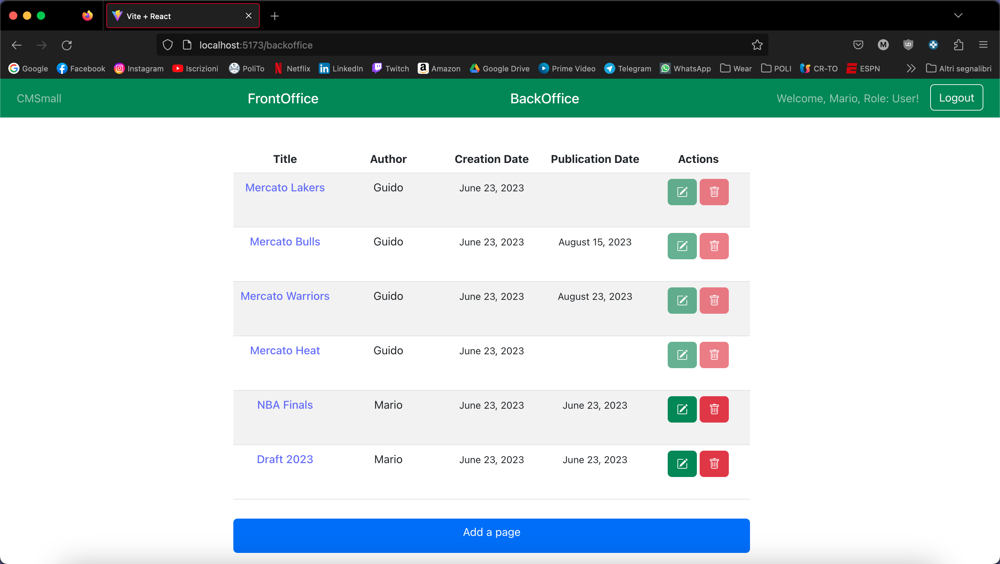
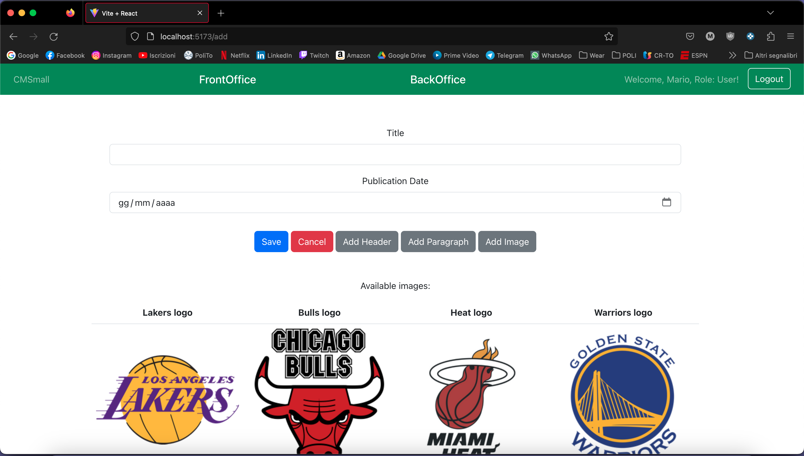

[](https://classroom.github.com/a/8AapHqUJ)
# Exam #1: "CMSmall"
## Student: s312957 VITALE MARCO 

## React Client Application Routes

- Route `/`: Inside of the root route we can find the front office, with all the published pages.
- Route `backoffice`: This is the route where we have all the available pages with the possibility to add,edit or delete them (The Backoffice).
- Route `add`: Here we can find the form to add a new page.
- Route `edit/:pageid`: Here we can find the form to edit the page with the corresponding pageid passed as a parameter in the route. This form is pre filled with all the available informations.
- Route `pages/:pageid`: This is the route in which the page with the corresponding pageid passed as a parameter is shown. This route has only a visualization purpose, the user cannot perform any action inside of it. 
- Route `*`: This route has the purpose to catch any path that has not been defined, it shows a page with a button that permits the user to come back to the root page (front office).
- Route `/login`: This route has the purpose to show the login form.

## API Server

### Users APIs

#### POST `/api/sessions`

* Description: authenticate the user who is trying to login
* Request body: credentials of the user who is trying to login

``` JSON
{
    "username": "guido.saracco@polito.it",
    "password": "polito2023"
}
```

* Response: `200 OK` (success)
* Response body: authenticated user

``` JSON
{
  "id": 3,
  "username": "guido.saracco@polito.it",
  "name": "Guido",
  "role": "Admin"
}
```

* Error responses:  `401 Unauthorized User` (login failed)


#### GET `/api/sessions/current`

* Description: verify if a user is still logged in
* Request body: _None_

* Response: `200 OK` (success)
* Response body: authenticated user

``` JSON
{
  "id": 3,
  "username": "guido.saracco@polito.it",
  "name": "Guido",
  "role": "Admin"
}
```

* Error responses:  `401 Not authenticated` (login failed)
#### DELETE `/api/session/current`

* Description: logout current user
* Request body: _None_
* Response: `200 OK` (success)

* Response body: _None_

* Error responses: `500 Internal Server Error` (generic error)

#### GET `api/users`

* Description: get the list of the name of the user in the db
* Request body: _None_

* Response: `200 OK` (success)
* Response body: list of the user

``` JSON
[
  "Mario",
  "Luigi",
  "Guido",
  "Luca"
]
```

* Error responses: `500 Internal Server Error` (generic error), `401 Unauthorized User` (user is not logged in or is not an admin)

### Title APIs

#### GET `api/title`

* Description: get the title of the website
* Request body: _None_

* Response: `200 OK` (success)
* Response body: the name of the website

``` JSON
"CMSmall"
```

* Error responses: `500 Internal Server Error` (generic error)

#### PUT `api/title`

* Description: update the title of the website
* Request body: an object containing the new title

``` JSON
{
    "title": "CMSmall"
}
```

* Response: `200 OK` (success)
* Response body: the new name of the website

``` JSON
"CMSmall"
```

* Error responses: `500 Internal Server Error` (generic error), `401 Unauthorized User` (user is not logged in or is not an admin), `422 Unprocessable Entity` (validation error)

### Page APIs

#### GET `/api/pages`

* Description: get all the pages in the db
* Request body: _None_
* Request query parameter: filter name of the filter to apply (all/published)
* Response: `200 OK` (success)
* Response body: Array of objects, each describing a page:

``` JSON
[
  {
    "id": 1,
    "title": "Mercato Lakers",
    "author": "Guido",
    "creationDate": "2023-06-23",
    "publicationDate": null
  },
  {
    "id": 2,
    "title": "Mercato Bulls",
    "author": "Guido",
    "creationDate": "2023-06-23",
    "publicationDate": "2023-08-15"
  }
]
```
* Error responses: `500 Internal Server Error` (generic error), `401 Unauthorized User` (user is not logged in and is requesting all the pages)

#### GET `/api/pages/:id`

* Description: get the page with the corresponding id passed as a parameter
* Request body: _None_

* Response: `200 OK` (success)
* Response body: The object describing the page:

``` JSON
  {
    "id": 1,
    "title": "Mercato Lakers",
    "author": "Guido",
    "creationDate": "2023-06-23",
    "publicationDate": null
  }
```
* Error responses: `500 Internal Server Error` (generic error), `422 Unprocessable Entity` (validation error),  `404 Not Found` (wrong id)

#### POST `/api/pages`

* Description: Add a new page in the db
* Request body: Object containing the page properties and the associated blocks into an array

``` JSON
{
  "title":"Titolo",
  "creationDate":"2023-06-23",
  "publicationDate":"",
  "author":"",
  "blocks":[
            {"type":"Header",
            "content":"Nuovo header"},
            {"type":"Image",
            "content":"heatlogo.png"}
            ]
}
```

* Response: `201 Created` (success)
* Response body: The object describing the page in the db:

``` JSON
{
  "id": 7,
  "title": "Titolo",
  "author": "Guido",
  "creationDate": "2023-06-23",
  "publicationDate": null
}
```
* Error responses: `500 Internal Server Error` (generic error), `422 Unprocessable Entity` (validation error), `401 Unauthorized User` (user is not logged in)

#### PUT `/api/pages/:id`

* Description: Update the page with the corresponding id passed as a parameter
* Request body: Object containing the new page properties and the associated blocks into an array

``` JSON
{
  "title":"Titolo",
  "creationDate":"2023-06-23",
  "publicationDate":"",
  "author":"Guido",
  "blocks":[
            {"id":47,
            "pageid":7,
            "type":"Header",
            "content":"Nuovo header modificato",
            "position":1},
            {"id":48,
            "pageid":7,
            "type":"Image",
            "content":"heatlogo.png",
            "position":2}
            ],
  "id":7
}
```

* Response: `200 OK` (success)
* Response body: The object describing the page in the db:

``` JSON
{
  "id": 7,
  "title": "Titolo",
  "author": "Guido",
  "creationDate": "2023-06-23",
  "publicationDate": null
}
```
* Error responses: `500 Internal Server Error` (generic error), `422 Unprocessable Entity` (validation error), `401 Unauthorized User` (user is not logged in/ normal user trying to update a page for who is not the author/ normal user trying to update the auhtor o a page), `404 Not Found` (wrong id)

#### DELETE `/api/pages/:id`

* Description: delete the page with the corresponding id passed as a parameter
* Request body: _None_

* Response: `200 OK` (success)
* Response body: _None_

* Error responses: `500 Internal Server Error` (generic error), `422 Unprocessable Entity` (validation error), `404 Not Found` (wrong id), `401 Unauthorized User` (user is not logged in or normal user trying to delete a page of another user)

#### GET `/api/pages/:id/blocks`

* Description: get all the blocks related to the page with the corresponding id passed as a parameter
* Request body: _None_

* Response: `200 OK` (success)
* Response body: Array of blocks

``` JSON
  [
  {
    "id": 41,
    "pageid": 2,
    "type": "Header",
    "content": "Chicago Bulls sondano il mercato",
    "position": 1
  },
  {
    "id": 42,
    "pageid": 2,
    "type": "Paragraph",
    "content": "Quest’estate diversi All-Star potrebbero cambiare maglia: oltre a Bradley Beal, anche Zach LaVine potrebbe essere messo sul mercato dai Chicago Bulls, che secondo Yahoo Sports stanno \"silenziosamente sondando l’interesse delle squadre rivali\" per la loro stella. LaVine ha completato il primo di cinque anni di contratto da 215 milioni di dollari complessivi",
    "position": 2
  },
  {
    "id": 43,
    "pageid": 2,
    "type": "Image",
    "content": "bullslogo.png",
    "position": 3
  }
]
```
* Error responses: `500 Internal Server Error` (generic error), `422 Unprocessable Entity` (validation error),  `404 Not Found` (wrong id)

## Database Tables

- Table `users` - contains:
    - id of the user (Primary key)
    - email
    - name (unique for each user)
    - hash (hash of the pwd together with the salt)
    - salt
    - role (Admin/User)

- Table `website` - contains:
  - id (Primary key)
  - title (the title of the website)

- Table `pages` - contains:
  - id of the page (Primary key)
  - title
  - author (References name of the `user` table)
  - creation_date
  - publication_date

- Table `blocks` - contains:
  - id of the block (Primary key)
  - pageid (References id of the `pages` table)
  - type (Header/Paragraph/Image)
  - content
  - position

## Main React Components

- `LoginForm` (in `Auth.jsx`): contains the form to perform the login, the login button is inside of it

- `Navigation` (in `Navigations.jsx`): contains the navbar that has inside of it the buttons to navigate to the backoffice or the frontoffice, the login/logout button and the website title, with the possibility to change it.

- `PageForm` (in `PageForm.jsx`): contains the form in which the user can create/modify a page. Here we can find different buttons, that permit the user to add a block (header/paragraph/image). In case of an image block the user has the possibility to choose from four different images that are shown in the bottom side of the page. The save button permits to send the request after checking that the all the infos are valid. The cancel button instead navigate the user back to the backoffice. The possibility to change the author of a page is handled inside this form, after checking that the user is an Admin.

- `MainLayout` (in `PageLayout.jsx`): this component has the duty to fetch from the db the list of pages, requesting all the pages or only the published, according to the URL in which is mounted (ALL if in the backoffice/ published if in the frontoffice). Those pages  and the function that request the delete of a page are then passed to the PagesTable component (later decsribed). Inside of MainLayout we can also find the button to add a new page, that redirect the user to the correct route that will render the PageForm previously described.

- `EditLayout` (in `PageLayout.jsx`): this component has the duty to fetch from the db the page with the id inserted in the parameter. This page and the function that request the edit of a page are then passed to the PageForm component previously described.

- `SinglePageLayout` (in `PageLayout.jsx`): this component has the duty to fetch from the db the page with the id inserted in the parameter and the related blocks. Those informations are then passed to the SinglePage component (in `SinglePage.jsx`) that will only display the blocks showing the content of the page.

- `PagesTable` and `PageRow` (in `PagesList.jsx`): those two components are used together to show the pages in a table. Each page available is mapped into a PageRow where we can find all the related informations and also the buttons (if in the backoffice) that permits the user to edit or delete the page. Those buttons are disabled if the user who is logged in is not an admin and is not the author of the page.


## Screenshot

List of all pages



Creating a new page



## Users Credentials

- email: "mario.rossi@polito.it" pwd: "password", username: "Mario", role: User

- email: "luigi.verdi@polito.it", pwd: "strongpwd", username: "Luigi", role: User

- email: "guido.saracco@polito.it", pwd: "polito2023", username: "Guido", role: Admin

- email: "luca.blu@polito.it", pwd:"rossoblu", username: "Luca", role: User
